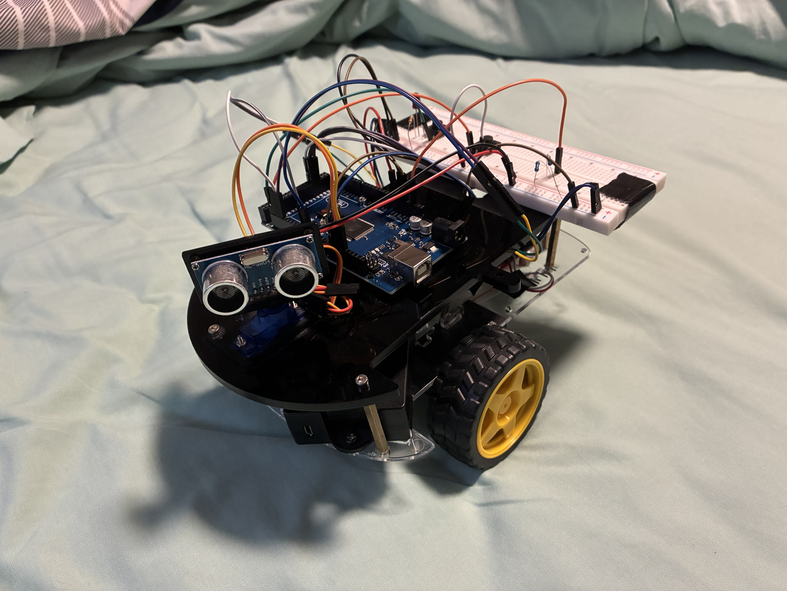

# Autonomous Mapping Robot (Differential Drive)

A Mechatronics engineering project designed to navigate a room perimeter autonomously and generate a 2D spatial map. The robot uses custom odometry math and ultrasonic projection to transform raw sensor data into a high-definition car path.

| Robot Build |  |
| :---: | :---: |
| Robot Schematic |  |
| :---: | :---: |
| Live Demo | [](https://youtube.com/shorts/CDQi3uIZbc0) |

## 🛠 Features
* **Differential Odometry:** Real-time tracking of $x$, $y$, and $\theta$ (heading) using high-resolution quadrature encoders.
* **Intelligent Wall-Following:** PD-style control logic to maintain a consistent 35cm safety buffer from obstacles using an ultrasonic sensor.
* **Data Logging:** Captures coordinates every 2.5 cm of travel, stored in a 400-point array for USB serial transmission.
* **Self-Correction:** Validated encoder polarity to ensure turns and straight-line distances are calculated with high precision.

---

## 🚀 Hardware Stack
* **Controller:** Arduino MEGA 2560 (ATmega2560)
* **Sensors:** HC-SR04 Ultrasonic Sensor, Dual Quadrature Encoders
* **Communication:** USB Serial Interface (115200 Baud)
* **Chassis:** Two-wheel differential drive (N20 encoder motors driven by L298N driver) with a front swivel caster
* **Power:** 7.4V Li-ion Battery Pack

---

## 💻 Control Logic (Finite State Machine)
The firmware cycles through three primary states to ensure reliable navigation:
1.  **ALIGNING:** Corrects the robot's heading relative to the side wall to maintain the set distance.
2.  **DRIVING:** Executes forward motion while recording points to the internal memory array.
3.  **STUCK:** Detects front-facing obstacles and executes a precision pivot turn to transition to the next wall.

---

## 📂 Project Structure
* `/Arduino`: Contains the `.ino` sketch for motor control, PID alignment, and odometry.
  * **Dependencies**: Requires the `Encoder.h` library by Paul Stoffregen.
  * **Installation**:
    1. Open the **Arduino IDE**.
    2. Go to **Sketch** -> **Include Library** -> **Manage Libraries...**
    3. Search for "Encoder" and look for the version by **Paul Stoffregen**.
    4. Click **Install**.
  * **Hardware Note**: Ensure your encoder pins are connected to interrupt-capable pins (e.g., Pins 2, 3, 18, 19, 20, 21) for the best performance.
* `/Python`: Visualization script to receive Bluetooth data and plot the resulting map using Matplotlib.
  * **Dependencies**: This script requires `matplotlib`, `numpy`, and `pyserial` to function.
  * **Installation**: Open your computer's system terminal (Command Prompt, PowerShell, or Terminal) and run the following command:
      ```bash
      pip install matplotlib numpy pyserial
      ```
* `/Docs`: Technical diagrams for sensor placement and coordinate system geometry.

---

## Technical Difficulties

* **Wireless Communication:** Initially attempted to utilize an **HC-05 Bluetooth module** to stream data and preserve Arduino SRAM. However, the module encountered persistent driver incompatibilities with the host laptop, necessitating a shift in data handling.
* **Hardware Failure:** During hardware integration testing, the **servo motor** controlling the ultrasonic sensor sweep experienced an electrical short. As a result, the sensor is currently in a fixed-forward position for the mapping logic.

---

## How to Run
1. Allow the car to follow the perimeter of the room.
2. Open the `map_plotting.py` file and wait for data transmission.
3. Press the data transmission button on the breadboard.
5. PNG file of the map output should open.

---

## 👤 Author
**Johnny Van Bakel** *Mechatronics Engineering Student* *McMaster University*
